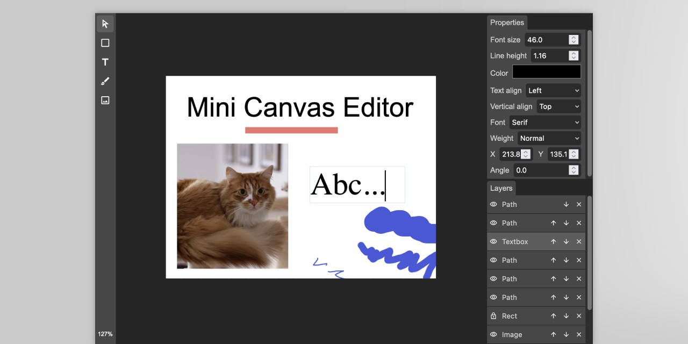

# Mini Canvas Editor

[](https://actions-badge.atrox.dev/img-js/mini-canvas-editor/goto?ref=main) [](https://npmjs.org/package/mini-canvas-editor)

Canvas editor component for JavaScript application. Works with any front-end framework. Easy to integrate and use. Well-known graphical interface. Edit images, draw shapes, add texts and more. Gzipped size less than 100 KB. Uses Fabric.js internally.

Main use cases:

* resize image,
* crop image,
* create a template, render it on the front-end and the back-end (Node.js only),
* create inpainting mask.

Online Examples:

* [🎬 Template Creator](https://img-js.github.io/mini-canvas-editor/webpack-app/public/template-creator.html)
* [🎨 Inpainting Mask](https://img-js.github.io/mini-canvas-editor/webpack-app/public/inpainting-mask.html)
* [🔲 Crop](https://img-js.github.io/mini-canvas-editor/webpack-app/public/crop.html)
* [📦 Vanilla JavaScript](https://img-js.github.io/mini-canvas-editor/webpack-app/public/vanilla-javascript.html)

## 🚀 Installation

To use the editor you should add JS/TS files and CSS files to your project.

### NPM

Install this package by [NPM](https://www.npmjs.com/) command:

`npm i mini-canvas-editor`

To import the package:

```ts
import { Editor } from 'mini-canvas-editor';
```

If you use [css-loader](https://webpack.js.org/loaders/css-loader/) or similar, you can add CSS files to your bundle:

```ts
import 'mini-canvas-editor/css/editor.css';
```

To create the editor write the below code:

```ts
Editor.createBlank(placeholder, 200, 300, {});
```

### CDN

Add the below code to your head section in HTML document.

```html
<head>
...
<link href="https://cdn.jsdelivr.net/npm/mini-canvas-editor@0.2.0/css/editor.css" rel="stylesheet">
<script src="https://cdn.jsdelivr.net/npm/mini-canvas-core@0.2.0/dist/index.umd.js"></script>
<script src="https://cdn.jsdelivr.net/npm/mini-canvas-editor@0.2.0/dist/index.umd.js"></script>
```

Create the editor by:

```js
miniCanvasEditor.Editor.createBlank(placeholder, 200, 300, {});
```

## 💡 License

Pick one license that fits your needs.

| License          | Details |   |
| ---------------- | -       | - |
| 🍪 Hobby         | **1** application<br />**1** developer<br />1 year updates | [📦 Buy license](https://buy.stripe.com/14k8yq3p048L7fO4gj) |
| 🍰 Standard      | **2** applications<br />**up to 4** developers<br />1 year updates | |
| 🎂 Enterprise    | **unlimited** applications<br />**unlimited** developers<br />1 year updates | |

The license is perpetual. By buying the license you get an access to the source code of the editor.

See the [LICENSE](/LICENSE) file for more details.
